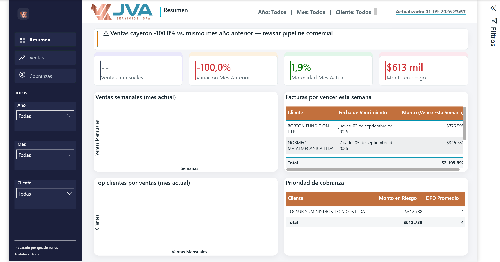
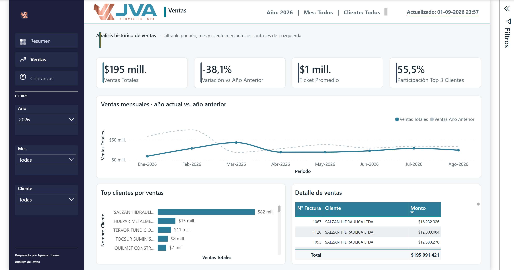
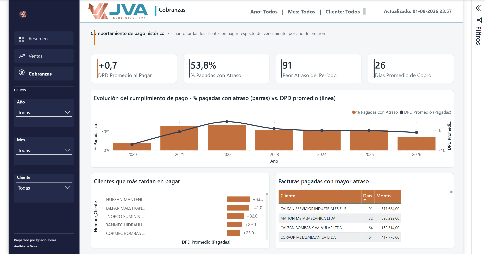

# Dashboard Financiero JVA

Un dashboard ejecutivo en Power BI para una empresa chilena de servicios industriales (JVA Servicios SPA), construido bajo un principio: **cada visual tiene que responder una pregunta de negocio específica, no solo mostrar un número.**

El reporte tiene tres páginas, con navegación real entre ellas desde el panel lateral: **Resumen** (foto ejecutiva del mes en curso), **Ventas** (análisis histórico y filtrable) y **Cobranzas** (comportamiento de pago en el tiempo).

Este documento parte por lo que el dashboard **encontró** — cinco hallazgos de negocio y las acciones que se desprenden de ellos — y después recorre cómo está construido: las decisiones de diseño de cada página, el modelo de datos, y los cinco bugs de calidad que aparecieron en el camino.



*(Todos los nombres, RUTs y montos son sintéticos — ver "Sobre los datos" más abajo.)*

---

## Las preguntas que responde

El dashboard no se diseñó como una galería de gráficos. Nació de cinco preguntas concretas del dueño y del área de administración, y cada página existe para responder alguna de ellas:

| # | Pregunta de negocio | Dónde se responde |
|---|---|---|
| 1 | ¿Cómo vamos este mes, contra una base justa de comparación? | Resumen — *Ventas del mes* + *Variación vs. año anterior* |
| 2 | ¿De dónde vienen los ingresos, y qué tan expuestos estamos a perder un cliente? | Ventas — *Participación Top 3* + ranking de clientes |
| 3 | ¿Qué clientes crecen, cuáles se estancaron y cuáles dejaron de comprar? | Ventas — ranking y detalle, filtrable por período |
| 4 | ¿Cuánto tardan los clientes en pagarnos, y está mejorando o empeorando? | Cobranzas — *% Pagadas con Atraso* + *DPD Promedio* |
| 5 | ¿Qué hay que cobrar hoy, y qué vence esta semana? | Resumen — *Prioridad de cobranza* + *Por vencer esta semana* |

---

## Hallazgos principales

Cinco resultados del análisis, calculados sobre el set publicado en `data/`. Los montos están escalados por un factor único, así que **las proporciones, participaciones y variaciones porcentuales son idénticas a las reales**; solo los valores absolutos son ficticios.

Todas las cifras de esta sección se reproducen con un comando, sin abrir Power BI:

```bash
python scripts/hallazgos.py
```

### 1. Un solo cliente concentra el 42 % de la facturación

En lo que va de 2026 el mayor cliente representa el **41,8 %** de lo facturado, y los tres mayores el **55,1 %**. En 2025 la concentración fue todavía más alta: 43,4 % y 62,3 %.

| Año | Clientes activos | Top 1 | Top 3 | Top 5 |
|---|---:|---:|---:|---:|
| 2025 | 43 | 43,4 % | 62,3 % | 69,5 % |
| 2026 | 36 | 41,8 % | 55,1 % | 63,3 % |

Perder ese cliente no sería un mal trimestre: sería la mitad del negocio. Es el riesgo más grande que muestran estos datos, y no aparece en ningún estado de resultados.

### 2. Las ventas caen 37,6 % contra el mismo período del año anterior

| Comparación | Resultado |
|---|---:|
| Ene–sep 2026 ($196.659.698) vs. **mismo tramo** de 2025 ($315.396.705) | **−37,6 %** |
| Ene–sep 2026 vs. año 2025 **completo** | −58,9 % |

El segundo número circula solo si nadie revisa el denominador: compara nueve meses contra doce. La medida `Ventas Año Anterior` acota la base al mismo tramo justamente para que la KPI no exagere la caída — ver el hallazgo 4 de calidad de datos.

### 3. La base de clientes se contrajo 29 % en dos años

**51** clientes facturaron en 2024, **43** en 2025 y **36** en lo que va de 2026.

De los 43 activos en 2025, **24 no han vuelto a comprar** — y representaban el **26,0 %** de la facturación de ese año ($124.407.468). Entraron 17 clientes nuevos, que no alcanzan a compensar.

### 4. El ticket promedio cayó a la mitad desde 2024

| Año | Ventas | Facturas | Ticket promedio |
|---|---:|---:|---:|
| 2024 | $588.648.768 | 252 | $2.335.908 |
| 2025 | $478.954.471 | 256 | $1.870.916 |
| 2026 | $196.659.698 | 137 | $1.435.472 |

2025 es el dato que ordena el diagnóstico: se emitieron **más** facturas que en 2024 y aun así se facturó menos. La caída no viene de hacer menos trabajos, sino de que los trabajos son más chicos. Son dos problemas distintos y conviene no confundirlos.

### 5. La cobranza es la única serie que mejora — y lo hace de forma sostenida

El porcentaje de facturas pagadas con atraso bajó de **64,3 % (2022) a 35,8 % (2026)**, y el DPD promedio pasó de **+3,9 días a −1,1**: hoy los clientes pagan, en promedio, un día *antes* del vencimiento. La serie completa está en [Cumplimiento de pago por año](#cumplimiento-de-pago-por-año-de-emisión).

> **En una frase:** JVA cobra cada vez mejor un negocio cada vez más chico y más concentrado. El problema no está en la caja — está en la cartera de clientes.

---

## Recomendaciones ejecutivas

### 1. Convertir la concentración en un KPI con umbral, no en un dato de contexto

La medida `Participacion Top3 Clientes` ya está construida y se muestra en Ventas, pero hoy es informativa. Definir un umbral explícito (50 % es un punto de partida razonable) y revisarlo mensualmente convierte un número en una alerta. Sin umbral, un 62 % se lee igual que un 40 %.

### 2. Trabajar la lista de los 24 clientes que no volvieron, priorizada por facturación 2025

Es la acción comercial más barata disponible: son clientes que ya compraron, con contacto establecido y trabajo previo documentado en las órdenes de trabajo. Recuperar un tercio de ese 26 % compensaría buena parte de la caída del año. La página Ventas entrega la lista filtrando 2025 y contrastando contra 2026.

### 3. Medir por separado cuánto de la caída es volumen y cuánto es ticket

Menos clientes explica una parte; trabajos más chicos, otra. La respuesta cambia la decisión: si es volumen, el problema es comercial; si es ticket, es de mix de servicios o de precios. Hoy se pueden separar filtrando por cliente y período, pero conviene dejarlo como vista fija en vez de reconstruirlo cada vez.

### 4. Capitalizar la mejora de cobranza en las condiciones comerciales

Cuando los clientes pagan en promedio *antes* del vencimiento, el plazo de crédito otorgado es más largo de lo que el comportamiento real exige. Hay espacio para dos movimientos de bajo riesgo: plazos más cortos en clientes nuevos, y descuento por pronto pago con los que ya pagan bien.

### 5. Cerrar el registro del estado de pago en el origen

La mejora de cobranza medida arriba se sostiene sobre datos que hoy se anotan a mano — y a veces como comentario de celda, invisible para cualquier lectura automática (ver el hallazgo 2 de calidad de datos). Mientras el flag "Pagada" dependa de que alguien se acuerde de marcarlo, todo indicador de cobranza es frágil. El pipeline hoy compensa el problema; no lo resuelve.

> Los hallazgos describen el set de demostración publicado en este repositorio. Las proporciones y variaciones reproducen exactamente las de producción; los montos absolutos, no.

---

## Las tres páginas

| Página | Pregunta que responde | Alcance temporal |
|---|---|---|
| **Resumen** | "¿Cómo vamos *este mes*, en 10 segundos?" | Fijo al mes calendario actual |
| **Ventas** | "¿De dónde vienen los ingresos, en el tiempo y por cliente?" | Filtrable — abre en el año en curso |
| **Cobranzas** | "¿Cuánto tardan los clientes en pagarnos, y está mejorando?" | Toda la serie histórica |

Resumen deliberadamente **no** es un subconjunto filtrado de las otras dos. Es una foto fija: sus KPIs ignoran los slicers por diseño. Ventas y Cobranzas son donde filtrar importa. Separarlo así fue en sí una decisión de diseño.

---

## Resumen — la foto ejecutiva

### Los 4 KPIs principales

| KPI | Pregunta de negocio | Por qué este y no otro |
|---|---|---|
| **Ventas mensuales** | "¿Cuánto facturamos este mes?" | El primer número que revisa un dueño. Total bruto, sin ruido por cliente. |
| **Variación vs. año anterior** | "¿Crecemos o caemos, contra una base justa?" | Mes contra mes anterior es ruidoso por estacionalidad; contra el mismo mes del año pasado, no. |
| **Morosidad** | "¿Qué fracción de las facturas abiertas está vencida?" | Es un porcentaje: detecta problemas de *cultura de pago*, independiente del tamaño de una factura puntual. |
| **Monto en riesgo** | "¿Cuántos pesos están en juego ahora mismo?" | El complemento en pesos de la Morosidad. Juntos cubren ambos ángulos. |

**Por qué los 4 ignoran los slicers:** esta página está pensada para mirarse de reojo. Si los cuatro números principales pudieran cambiar según qué slicer tocó alguien por última vez, la página falla en su único trabajo. Cada KPI ancla a `TODAY()` y envuelve el cálculo en `REMOVEFILTERS`. Las versiones filtrables de las mismas métricas existen — viven en Ventas y Cobranzas.

### Paneles de apoyo

| Panel | Alcance | Por qué |
|---|---|---|
| **Ventas semanales** | Semanas dentro del mes actual | Responde "¿el mes viene cargado al inicio o al final?". Una ventana móvil de 4 semanas difuminaría los límites del mes. |
| **Top clientes por ventas** | Mes actual | El drill-down natural desde el KPI de ventas. |
| **Prioridad de cobranza** | Tiempo real, sin acotar por mes | Estar vencido no es un concepto de calendario. Acotarlo a "este mes" escondería una factura impaga de hace cuatro meses. |
| **Facturas por vencer esta semana** | Semana actual | Panel *preventivo*: facturas que vencen pronto y todavía no están atrasadas, para actuar antes de que el cliente sea estadística de morosidad. |

---

## Ventas — análisis histórico



Cuatro KPIs que **sí** responden a los slicers: Ventas Totales, Variación vs. Año Anterior, Ticket Promedio y Participación Top 3 Clientes. El gráfico principal ocupa el ancho completo y superpone el año actual contra el anterior; abajo, ranking de clientes y detalle de facturas.

La página abre filtrada al año en curso. Sin ese valor por defecto, el gráfico mostraría ~100 puntos mensuales ilegibles y la KPI de variación no significaría nada — con todo el histórico en contexto, comparar contra "el año anterior" compara el rango consigo mismo desplazado y da cerca de cero.

---

## Cobranzas — comportamiento de pago



Esta página **no** mide riesgo actual. Eso ya lo cubre Resumen, y en estos datos la cartera vencida real es una sola factura: construir un panel de *aging* habría dado un gráfico con una barra.

Lo que sí hay es señal histórica: **el porcentaje de facturas pagadas con atraso cayó de 64,3 % en 2022 a 35,8 % en 2026**, y el DPD promedio pasó de +3,9 días a −1,1 (hoy los clientes pagan, en promedio, un día antes del vencimiento). El gráfico principal cruza ambas series.

Cuatro KPIs nuevos, distintos de los de cartera abierta: DPD Promedio al Pagar, % Pagadas con Atraso, Peor Atraso del Período y Días Promedio de Cobro (equivalente a DSO).

---

## Los bugs de calidad de datos

Esta es la parte del proyecto que más enseñó. Ninguno se encontró buscándolo: todos aparecieron al validar un número que se veía raro. Abajo va el resumen; el detalle completo — síntoma, causa, corrección y efecto medido de cada uno — está en [`documentacion/calidad_datos.md`](documentacion/calidad_datos.md).

### 1. La morosidad marcaba 51,5%; el número real era ~10%

La medida contaba facturas pagadas *tarde* como si siguieran impagas, e incluía litigios de años anteriores sin relación con la cobranza activa. Se corrigió excluyendo los estados de litigio y sin registrar — sin borrar los registros, que se conservan para respaldo.

### 2. Un pipeline con un punto ciego invisible a cualquier comparación de valores

Los dos Excel (el que se mantiene a mano → el que lee Power BI) se sincronizan con un script diario. Una factura marcada como pagada, que la comparación automática insistía que calzaba, resultó ser un bug real: quien concilia los pagos a veces anota la fecha real como **comentario de celda de Excel** — invisible para cualquier script que lea *valores* — dejando el flag visible en "No". Un barrido completo encontró 9 casos más. El script ahora revisa, en orden de confiabilidad: comentario de celda → fecha en una columna que no le corresponde → flag manual.

### 3. Una variación porcentual que comparaba un cliente contra todos

`Ventas Periodo Anterior` usaba `FILTER(ALL(Fact_Facturas), …)`. Ese `ALL` borra también el filtro que llega **por relación** desde la tabla de clientes. Con un cliente seleccionado, comparaba las ventas *de ese cliente* contra las ventas *de todos* el año anterior. Un cliente que había crecido +84% aparecía con −92%.

Reemplazada por una medida que respeta el contexto de filtro:

```dax
Ventas Año Anterior =
VAR _corte = CALCULATE(MAX(Fact_Facturas[Fecha_Emision]), ALL(Fact_Facturas), ALL(Calendario))
RETURN
CALCULATE(
    [Ventas Totales],
    SAMEPERIODLASTYEAR(FILTER(VALUES(Calendario[Fecha]), Calendario[Fecha] <= _corte))
)
```

### 4. Un YoY que comparaba 8 meses contra 12

Al filtrar por año, el contexto de fecha era el año calendario completo, así que `SAMEPERIODLASTYEAR` traía el año anterior **entero** — mientras el año en curso solo tenía datos hasta agosto. La KPI marcaba −59,3% donde lo comparable era −38,1%. El `_corte` de la medida de arriba lo resuelve: acota la comparación a la última fecha con ventas reales. Efecto lateral útil: la serie del gráfico deja de dibujar una cola fantasma sobre los meses sin datos.

### 5. Ocho facturas con el año mal tipeado

Buscando el DPD histórico apareció un promedio de **−25.849 días** para 2022. La causa: comentarios de celda como `"Abonado en bco chile el 7-12-222"` — el año 2022 escrito como `222`. El parser aceptaba `222` como año válido (la corrección de dos dígitos no cubre tres), y `datetime` lo tomaba como el año 222 d.C.

El pipeline ahora repara el dígito perdido y descarta cualquier fecha de pago fuera de un rango plausible, dejando nota en el log de QA:

```python
def _repara_anio(y):
    if y < 100:   return y + 2000          # "26"  -> 2026
    if y < 1000:  return 2000 + (y % 100)  # "222" -> 2022
    return y
```

Con las fechas corregidas, el DPD promedio de 2022 pasó de −25.849 a **+4,3 días**.

---

## El modelo de datos

La tabla de calendario existía pero estaba prácticamente huérfana: una sola columna, relacionada solo con la fecha de vencimiento y usada por una única medida. Las ventas colgaban de la jerarquía de fechas automática de Power BI, lo que impide escribir inteligencia de tiempo limpia.

Se convirtió en una dimensión real (año, mes, período, orden), con la relación activa sobre la fecha de emisión y `USERELATIONSHIP` en las medidas de cobranza que deben seguir el vencimiento. Recién con eso `SAMEPERIODLASTYEAR` funciona sin inventar columnas calculadas en la tabla de hechos.

---

---

## Por qué PBIP/PBIR y no .pbix

Este repositorio no contiene ningún archivo `.pbix`. El reporte está guardado en **formato PBIP/PBIR**, que descompone lo que normalmente es un binario en archivos de texto:

```
Dashboard Finanzas.Report/definition/pages/<pagina>/visuals/<visual>/visual.json
Dashboard Finanzas.SemanticModel/definition/tables/<tabla>.tmdl
```

La diferencia práctica es que **el trabajo se puede revisar**. Cada medida DAX, cada relación del modelo y cada propiedad de cada visual son texto plano: aparecen en un `git diff`, se pueden comentar en un pull request y se puede rastrear cuándo y por qué cambió un cálculo. Con un `.pbix` binario, la única respuesta posible a "¿qué cambió acá?" es abrir el archivo y mirar.

Eso también hizo posible buena parte del trabajo documentado más abajo: los bugs de las medidas se encontraron leyendo y comparando definiciones, no haciendo clic por la interfaz.

---

## Valores de control

Cifras calculadas directamente sobre `data/BASE_DE_DATOS_JVA_demo.xlsx` con [`scripts/hallazgos.py`](scripts/hallazgos.py), para que cualquiera pueda abrir el reporte y verificar que reproduce lo mismo:

| Métrica | Valor |
|---|---:|
| Facturas cargadas por el modelo | **1.120** |
| Clientes | **213** |
| Órdenes de trabajo | **1.722** |
| Ventas totales | **$2.208.426.039** |
| Peor atraso registrado | **91 días** |
| Días promedio de cobro | **26** |

### Cumplimiento de pago por año de emisión

Es el hallazgo central de la página de Cobranzas: la proporción de facturas que se pagan con atraso viene cayendo de forma sostenida.

| Año | Facturas | Ventas | DPD prom. | % pagadas con atraso |
|---|---:|---:|---:|---:|
| 2020 | 5 | $61.473.085 | −7,0 | 20,0 % |
| 2021 | 28 | $308.445.547 | −0,7 | 65,2 % |
| 2022 | 207 | $210.439.821 | **+3,9** | **64,3 %** |
| 2023 | 235 | $363.804.649 | +0,6 | 51,4 % |
| 2024 | 252 | $588.648.768 | −0,1 | 53,4 % |
| 2025 | 256 | $478.954.471 | −0,2 | 53,4 % |
| 2026 | 137 | $196.659.698 | **−1,1** | **35,8 %** |

Un DPD negativo significa que, en promedio, se paga antes del vencimiento. 2020 y 2021 tienen muy pocas facturas, así que sus porcentajes no son representativos.

Las medidas DAX de cartera abierta excluyen los estados `En demanda` y `Sin registrar`. Esa exclusión no altera las columnas de esta tabla — ninguna de esas facturas tiene fecha de pago registrada — pero sí cambia la Morosidad y el Monto en Riesgo de la página Resumen.

---

---

## Cómo explorar el proyecto

| Si quieres revisar... | Empieza aquí |
|---|---|
| Los resultados del análisis | [Hallazgos principales](#hallazgos-principales) y [Recomendaciones ejecutivas](#recomendaciones-ejecutivas) |
| El caso de negocio y a quién sirve | [`documentacion/definicion_proyecto.md`](documentacion/definicion_proyecto.md) |
| Qué hay en los datos | [`documentacion/diccionario_datos.md`](documentacion/diccionario_datos.md) |
| Las medidas DAX una por una | [`documentacion/diccionario_kpis.md`](documentacion/diccionario_kpis.md) |
| El modelo y sus relaciones | [`documentacion/modelo_dimensional.md`](documentacion/modelo_dimensional.md) |
| Los bugs de datos, en detalle | [`documentacion/calidad_datos.md`](documentacion/calidad_datos.md) |
| Cómo se anonimizó el set | [`documentacion/anonimizacion.md`](documentacion/anonimizacion.md) |
| El pipeline diario | [`scripts/sync_facturacion_a_base.py`](scripts/sync_facturacion_a_base.py) |
| Reproducir los hallazgos tú mismo | [`scripts/hallazgos.py`](scripts/hallazgos.py) |
| Las definiciones del reporte | `Dashboard Finanzas.Report/definition/` — texto plano, se leen en el navegador |

---

## Stack

- **Power BI** — formato PBIP/PBIR, definiciones en texto plano comparables con git
- **DAX** para la capa de medidas
- **Python + openpyxl** para el pipeline de sincronización
- **Programador de Tareas de Windows** para la corrida diaria

---

## Qué hay en este repo

```
Dashboard Finanzas.Report/          Definición del reporte (PBIR) — 3 páginas
Dashboard Finanzas.SemanticModel/   Modelo semántico: tablas, medidas, relaciones
scripts/sync_facturacion_a_base.py  Sincronización diaria entre los dos Excel
scripts/hallazgos.py                Recalcula las cifras citadas en este README
scripts/anonimizar_demo.py          Genera el set de demostración
scripts/verificar_demo.py           Comprueba que el demo no filtre datos reales
data/BASE_DE_DATOS_JVA_demo.xlsx    Datos de ejemplo anonimizados
screenshots/                        Capturas usadas en este README
```

---

## Sobre los datos

Los datos de este repositorio son **sintéticos**. Nombres de clientes, RUTs y montos fueron reemplazados por equivalentes ficticios que preservan la misma estructura y los mismos problemas de calidad descritos arriba: el dashboard se ve idéntico sin exponer el negocio de nadie.

Dos decisiones que vale la pena explicitar, porque son fáciles de hacer mal:

**La llave de cliente es distinta a la de producción.** Si el identificador de cliente se conserva igual, basta cruzar dos hojas para deshacer el seudónimo: una tabla trae el ID junto al nombre falso, otra el mismo ID junto a algún rastro real. Anonimizar los nombres pero conservar la llave no anonimiza nada.

**Se anonimizaron todas las hojas, no solo las evidentes.** Los nombres de clientes no viven únicamente en la tabla de clientes: aparecen en descripciones de equipos, en notas de revisión, en ejemplos dentro de la documentación del esquema. Las marcas de bombas y motores son un caso particular — varias son también clientes, así que dejarlas delata la orden de trabajo aunque el nombre esté seudonimizado.

Los montos están escalados por un factor único, de modo que las proporciones — y por tanto todos los porcentajes del dashboard — se conservan exactos.

La anonimización es reproducible y **verificable**: `scripts/verificar_demo.py` recorre cada celda de cada hoja buscando cualquier nombre o RUT real, comprueba que las llaves no se solapen con producción y sale con código distinto de cero si encuentra algo. Se corre antes de cada publicación.

---

*Construido y mantenido por Ignacio Torres — Analista de Datos.*
